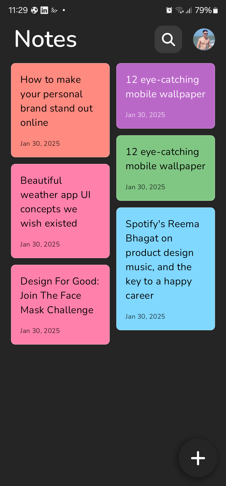
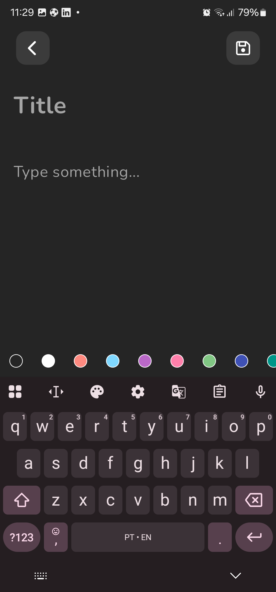
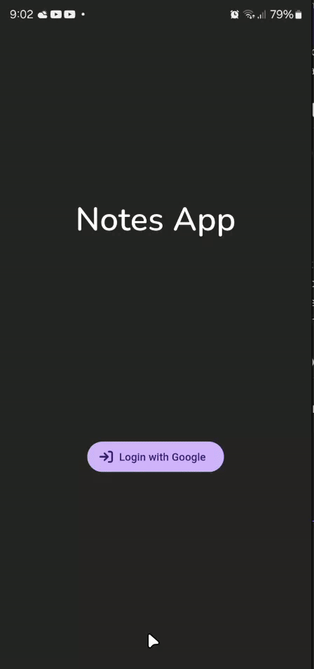
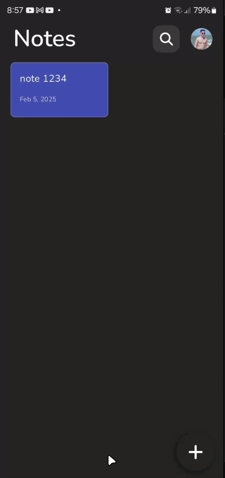
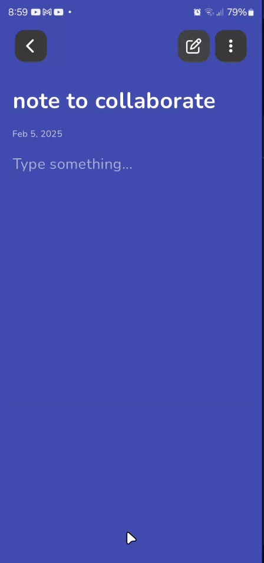
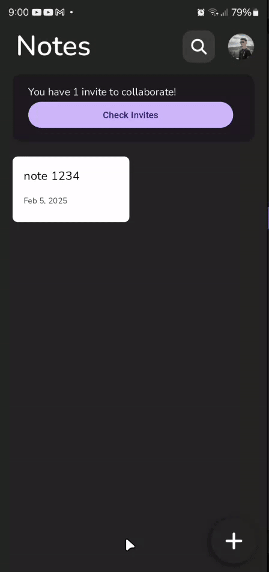
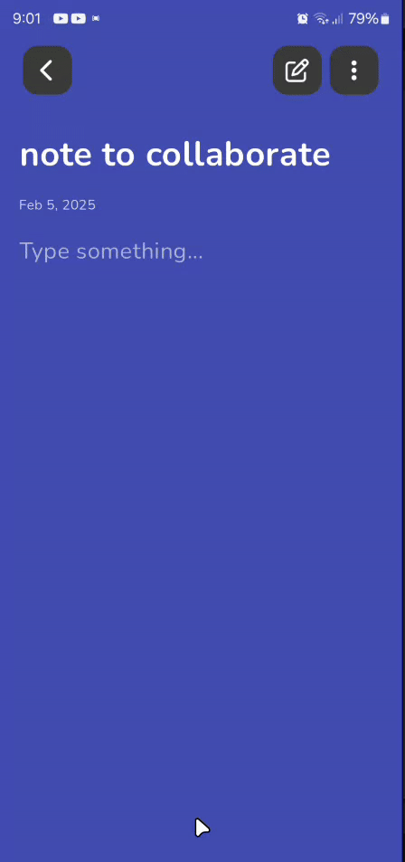

# Notes App

A notes app with cloud sync using Firebase Firestore and developed with Flutter.

Inspired by the concept of "Amal", available at [A simple and lightweight note app](https://dribbble.com/shots/11875872-A-simple-and-lightweight-note-app). Figma project available at [Notes App UI (Community)](https://www.figma.com/design/nZX8djGpHUhSCAQCNOINYq/Notes-App-UI-(Community)?node-id=0-1&p=f&t=L1Rj1BiHBUkWAY7O-0).

#### This project had the objetive of:
- Practice the login with Google flow using Firebase Authentication.
- Try to replicate screens to the app by using a Figma project.
- Try and learn how to use Firebase Firestore.

## Functionalities
- Log in with Google to save on Firebase Firestore.
- Write notes and vizualize them in dynamic blocks.
- Share notes with other accounts:
    - Invite another account to collaborate.
    - Accept or decline another account invites to collaborate.
    - The owner of the note is able to control the collaborators list.

## Screenshots

### Home Screen

### Editing Note Screen Empty

### Editing Note Screen Full

## App experience:

### Logging in with Google:

### Creating and deleting note:

### Inviting someone to be a collaborator:

### Accepting a invite to be a collaborator:

### Managing and removing a collaborator of a note:
